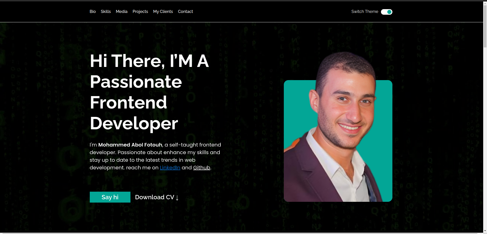

# Almdrsa - Personal website

This is a solution to the Almdrsa personal website first project in forntend course with Eng/Muhamed Abusrea.

## Table of contents

- [Overview](#overview)
  - [The challenge](#the-challenge)
  - [Screenshot](#screenshot)
  - [Links](#links)
- [My process](#my-process)
  - [Built with](#built-with)
  - [What I learned](#what-i-learned)
  - [Useful resources](#useful-resources)
- [Author](#author)
- [Acknowledgments](#acknowledgments)

## Overview

### The challenge

Users should be able to:

- View the optimal layout for the interface depending on their device's screen size
- See hover and focus states for all interactive elements on the page

### Screenshot

 

### Links

- Solution URL: [https://github.com/Mohammed-Abol-Fotouh/personal-portfolio-almdrsa](https://github.com/Mohammed-Abol-Fotouh/personal-portfolio-almdrsa)
- Live Site URL: [https://mohammed-abol-fotouh.github.io/personal-portfolio-almdrsa/](https://mohammed-abol-fotouh.github.io/personal-portfolio-almdrsa/)

## My process

### Built with

- Semantic HTML5 markup
- CSS custom properties
- CSS custom Variables
- Flexbox
- CSS Grid
- Responsive Design
- Sass

### What I learned

I learned how to implement light and dark theme in the website, recap for HTML,CSS

## Author

- Personal website- [Mohammed Abol Fotouh](https://mohammed-abol-fotouh.github.io/personal-portfolio-almdrsa/)
- LinkedIn- [Mohammed Abol Fotouh](https://www.linkedin.com/in/mohammed-abol-fotouh/)
- Github- [Mohammed Abol Fotouh](https://github.com/Mohammed-Abol-Fotouh)

## Acknowledgments

Thanks to Almdrsa Family, Special thanks to Eng/Muhamed Abusrea and Eng/Ahmad Fathy
